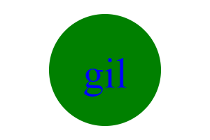

# SVG   LOGO MAKER

In the lesson you will be able to 
create a SVG with the choice of the 
 following shapes triangle,circle or square.
 You will also be able to enter 
 three characters plus add colors for 
 the characters and shape.

 # Pageages Used
 
 
 * inquier
 * Jest
 * SVG VS Code Extension

  <https://github.com/cantavexp/> 

  

https://drive.google.com/file/d/1CcOr3p5DSq_fNpj7-HcfIHxBodAUdAfQ/view

https://app.screencastify.com/manage/videos/ORSBilRQ6PmST6wfO1Uq

